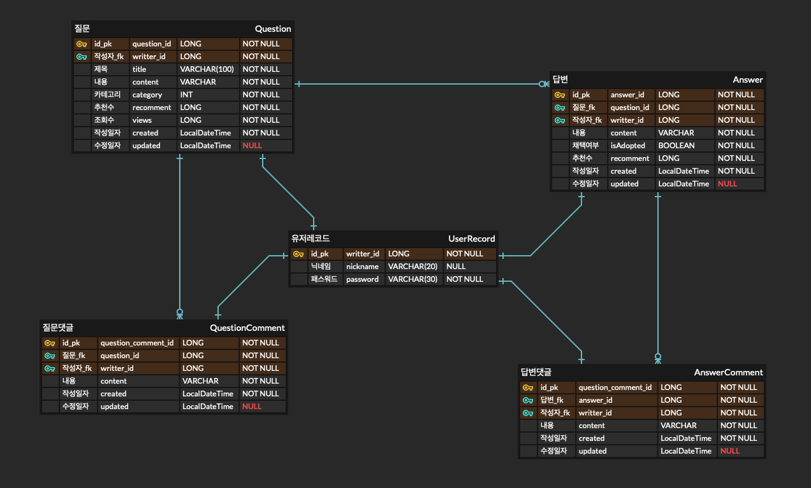

## ERD

### ERD diagram

&nbsp;

&nbsp;

***

### ERD description

- **작성자** - 질문, 답변, 댓글을 작성한 사용자가 입력한 데이터 
    - **닉네임** - 사용자가 글을 작성할 때 직접 입력한 닉네임
    - **패스워드** - 사용자가 글을 작성할 때 직접 입력한 패스워드, 패스워드 정보는 수정과 삭제의 기준이 되기에 암호화하여 저장

    ! :  작성자라는 별도의 테이블로 나타내었지만, 이 테이블의 목적은 이후 회원기능을 구현하기 위해 데이터 관리를 확장 가능하도록 하는데에 의의가 있습니다. 현재 프로젝트에서는 닉네임과 패스워드 정보만을 사용하고 있습니다. 그리고 포스트 1개가 생성이 되면 무조건 1개의 유저레코드가 생성되는 구조입니다. 이는 추후에 회원가입 기능을 구현할 때 마이그레이션을 고려하면서, 현재 주어진 프로젝트의 기본사양에서 크게 벗어나지 않는 선에서 구현하였습니다.

 &nbsp;

- **질문** - 사용자가 작성한 질문
    - **제목** - 사용자가 질문을 작성할 때 직접 입력한 제목
    - **내용** - 사용자가 질문을 작성할 때 직접 입력한 내용
    - **카테고리** - 질문 포스팅의 카테고리 정보, 현재 프로젝트에서는 'ft_irc', 'minishell', 'minirt' 세 가지 카테고리만 존재
    - **추천수** - 다른 사용자가 질문을 추천한 횟수를 나타냄
    - **조회수** - 다른 사용자가 질문을 조회한 횟수를 나타냄
    - **작성일자** - 사용자가 질문을 작성할 때의 작성일자
    - **수정일자** - 사용자가 질문을 수정할 때의 수정일자, 수정이 발생하지 않았다면 NULL로 처리

 &nbsp;

 - **답변** - 사용자가 질문에 대해 작성한 답변
    - **내용** - 사용자가 답변을 작성할 때 직접 입력한 내용
    - **채택여부** - 질문의 작성자가 답변을 채택했는지 여부를 나타냄
    - **추천수** - 다른 사용자가 답변을 추천한 횟수를 나타냄
    - **작성일자** - 사용자가 답변을 작성할 때의 작성일자
    - **수정일자** - 사용자가 답변을 수정할 때의 수정일자, 수정이 발생하지 않았다면 NULL로 처리

 &nbsp;

- **질문댓글** - 사용자가 질문에 대해 작성한 댓글
    - **내용** - 사용자가 댓글을 작성할 때 직접 입력한 내용
    - **작성일자** - 사용자가 댓글을 작성할 때의 작성일자
    - **수정일자** - 사용자가 댓글을 수정할 때의 수정일자, 수정이 발생하지 않았다면 NULL로 처리

 &nbsp;

- **답변댓글** - 사용자가 답변에 대해 작성한 댓글
    - **내용** - 사용자가 댓글을 작성할 때 직접 입력한 내용
    - **작성일자** - 사용자가 댓글을 작성할 때의 작성일자
    - **수정일자** - 사용자가 댓글을 수정할 때의 수정일자, 수정이 발생하지 않았다면 NULL로 처리

 &nbsp;